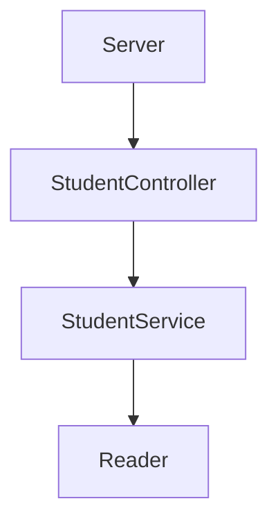

# Code Challenge Launch X 
## Este es un CodeChallenge propuesto por Launch X Backend Node Js

Para este code challenge se pide resolver lo siguiente :

Requerimientos:

1. Habilitar un endpoint para consultar todos los estudiantes con todos sus campos.
2. Habilitar un endpoint para consultar los emails de todos los estudiantes que tengan certificación haveCertification.
3. Habilitar un endpoint para consultar todos los estudiantes que tengan credits mayor a 500.




```mermaid
classDiagram
     class StudentController{
          +static getAllStudents(path)
          +static getStudentsByCertification(boolean, path)
          +static getStudentsByCredits(credits, path)
      }
      class StudentService{
          +static filterByCertification(students, boolean)
          +static filterByCredits(students, credits)
          +allStudents(students)
      }
      class Reader{
          +static readJsonFile(file)
      }
 ```
